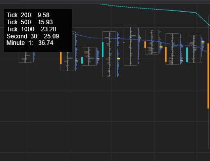

# Open ATR Viewer

<div style="text-align:center">
    
</div>

Open ATR Viewer simply displays the current ATR for various data series. This helps quickly identify a chart that you can switch to for trading based on the ATR. Make sure the chart you add it on is at least as large as the largest data series you include.

Add the indicator file. It's normally located at: C:\Users\<username>\Documents\NinjaTrader 8\bin\Custom\Indicators. Afterwards, open NinjaTrader and click New > NinjaScript Editor. Click the NinjaScript Editor and press F5 to compile.

Make sure the first data series is the lowest one out of all the data series.

```
else if (State == State.Configure)
{
    // The first added data series should be the lowest
    AddDataSeries(Data.BarsPeriodType.Tick, 200);
    AddDataSeries(Data.BarsPeriodType.Tick, 500);
    AddDataSeries(Data.BarsPeriodType.Tick, 1000);
    AddDataSeries(Data.BarsPeriodType.Second, 30);
    AddDataSeries(Data.BarsPeriodType.Minute, 1);
}
```
